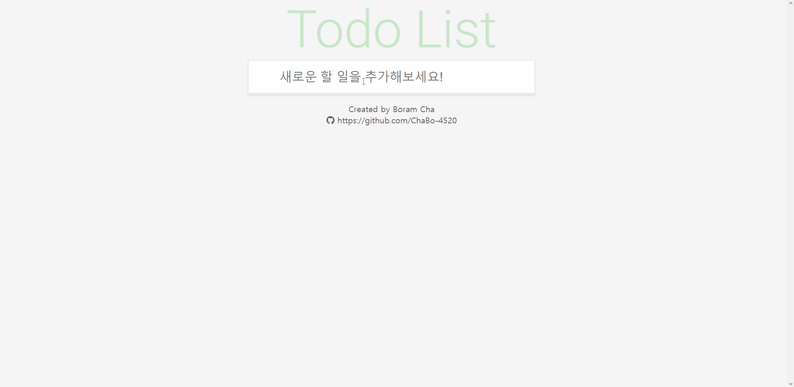

# ToDoList를 만들어보자!

## [ToDoList](https://chabo-4520.github.io/TodoList_Vue/)

👆**클릭해서 사용해보세요**

**개발기간** : 2021.07.09

**사용기술** : HTML, Css, **Vue.js**✨

**Plugin : Vuex, vue-router, fontawesome, bootstrap**

## 목표

> Vue를 이용하여 ToDoList를 만들어보자

## 프로젝트 계획 이유

> Vue.js를 공부하면서 
>
> 이전에 JavaScript를 이용해 만들었었던 TodoList를 토대로 빠르게 만들어보며 실습해보는 것이 좋다고 생각했습니다.

## 참고디자인

https://todomvc.com/examples/vanillajs/

## 기능 설명

1. **Input**
   - Input에 할 일을 작성하고 Enter를 입력하면 아래 할 일 목록에 추가됩니다.
2. **List**
   - 리스트에는 작성한 할 일 목록이 추가됩니다.
   - 각각의 목록은 우측의 ❌을 클릭하여 삭제할 수 있습니다.
   - 각각의 목록은 좌측의 ⭕를 클릭하여 완료 여부를 체크할 수 있습니다.
3. **Filter**
   - 가장 아래쪽에는 List를 필터링할 수 있는 버튼들이 있습니다.
   - All : 모든 목록을 볼 수 있습니다.
   - Active : 완료되지 않은 목록을 볼 수 있습니다.
   - Completed : 완료된 목록을 볼 수 있습니다.
4. **기타**
   - 우측하단의 Clear-completed버튼을 클릭하면 목록 중 완료된 목록 전체를 List에서 삭제할 수 있습니다.

## 업데이트 사항

- **2021.07.09**
  - **Release**
- **2021.07.10**
  - **Update**
    - 가장 왼쪽의 ✔를 클릭하여 모든 목록의 종료 여부를 토글하는 기능 추가
    - 남아있는 todo개수가 1개이면 1item~~s~~ left로 보여주기
  - **BugFix**
    - Filter Active상태에서 todo체크시 비정상적인 동작 확인
      - input[type="checkbox"]를 button으로 수정하고 클릭이벤트를 이용해 completed를 토글해주는 방식으로 변경
- **2021.07.11**
  - **Update**
    - 목록 더블클릭시 todo수정할 수 있는 기능추가
    - 목록에 hover시 삭제버튼 보이게함
    - 목록 삭제 및 완료된 항목 삭제시 confirm으로 확인
  - **BugFix**
    - div.content크기 오류로 체크박스 클릭안되는 문제
      - content크기 재설정으로 해결
- **2021.07.12**
  - **Refactoring**
    - TodoList.vue에서 getList action을 불러오던것을 App.vue가 created가 될 때 동작하도록 변경
  - **Design**
    - input과 li를 조금 더 반응형으로 수정
    - input의 placeholder만 반응형으로 변경
    - 전체적인 Color잡기
      - 버튼들 색 변경
      - 필터div 위치 조정
      - footer아래 디자인 추가
      - filter위치 조정
      - list사이 border조정
      - 전체적인 shadow조정
  - **BugFix**
    - 체크박스 더블클릭시에도 항목 수정이 동작하는 문제 해결
      - div.content로 editTodo메소드 이동
- **2021.07.15**
  - **Design**
    - Clear-completed버튼이 complete된 항목이 있을 때 나타나도록 변경
- **2021.07.16**
  - **Add**
    - bootstrap플러그인 추가
  - **Design**
    - 헤더 사이즈 변경

## 추가 예정

- ~~가장 왼쪽의 ✔를 클릭하여 모든 목록의 종료 여부를 토글하는 기능~~
- ~~남아있는 todo개수가 1개이면 1items left로 보여주기~~
- ~~버그 : Filter Active상태에서 todo체크시 비정상적인 동작 확인~~
- ~~목록 더블클릭시 todo수정할 수 있는 기능~~
- ~~목록에 hover시 삭제버튼 보이게함~~
- ~~목록 삭제 및 완료된 항목 삭제시 confirm으로 확인하기~~
- ~~반응형으로 input 글자크기 수정하기. (placeholder만 작아지게)~~
- ~~버그 : div.content크기 오류로 체크박스 클릭안되는 문제 수정필요~~
- ~~전체적인 Color잡기~~
- ~~Clear-completed버튼이 complete된 항목이 있을 때 나타나도록 변경~~
- 오른쪽 아래에 메뉴얼 추가
- 버그 : clear-complete클릭 후 비정상적인 동작 => 남은 항목들에 대한 컨트롤이 불가능함